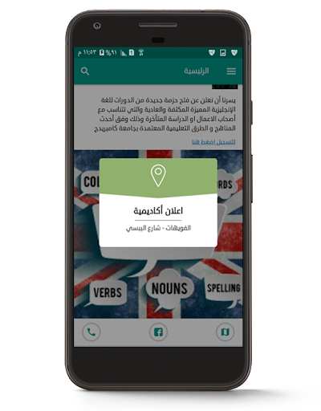
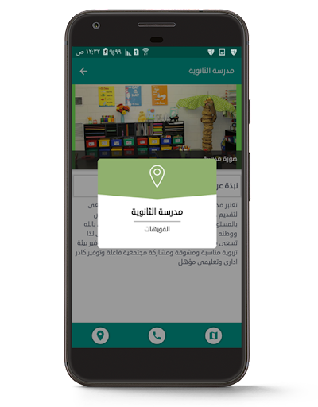
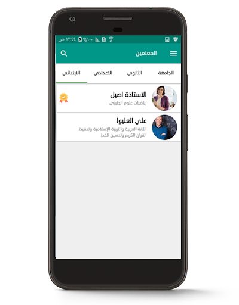
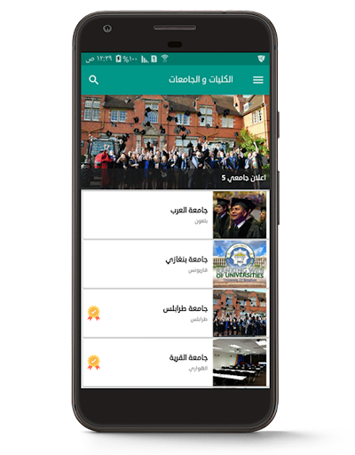
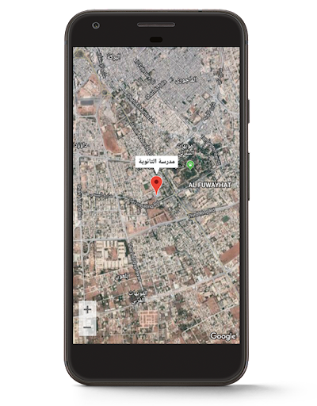
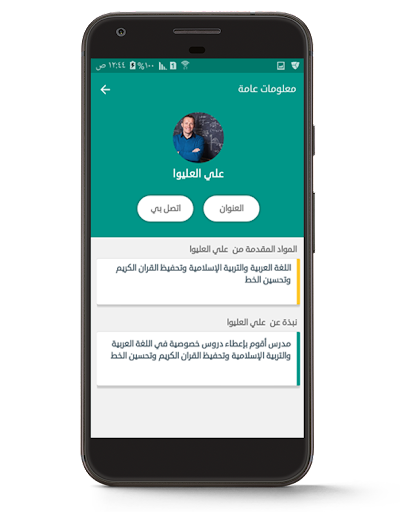
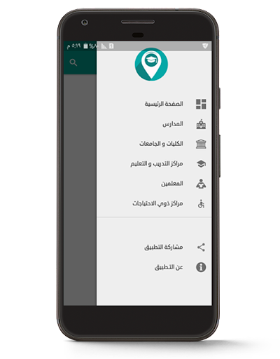
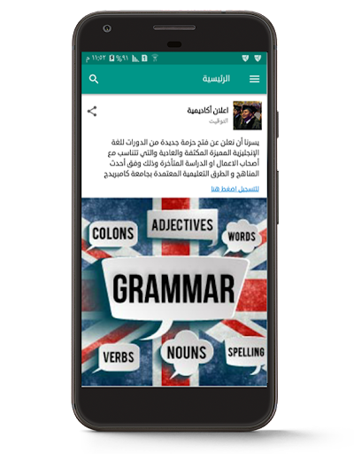

# iMentor Project

                Discover a world of educational opportunities with iMentor.
## Brief description 
iMentor is an app bridging students, universities, and educational centers in Benghazi, Libya. Whether online or in-person, access a myriad of courses and detailed information on schools, universities, private teachers, and special needs centers. From addresses to contacts, iMentor ensures users have comprehensive insights for informed decisions. Tailored for students, universities, language centers, and private teachers, iMentor simplifies the educational landscape. Unlock access to vital information, empowering users to navigate and connect effortlessly with diverse educational resources.
### Screenshots of the App 

## Feedback

If you have any feedback, please reach out to me at sofyanalojaly@gmail.com

